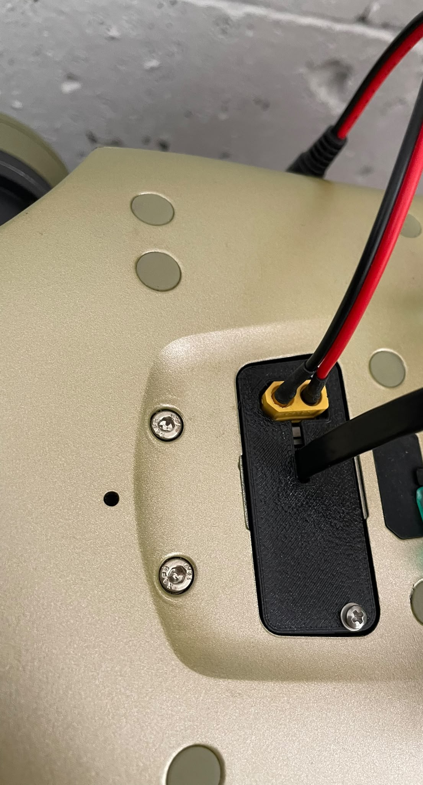
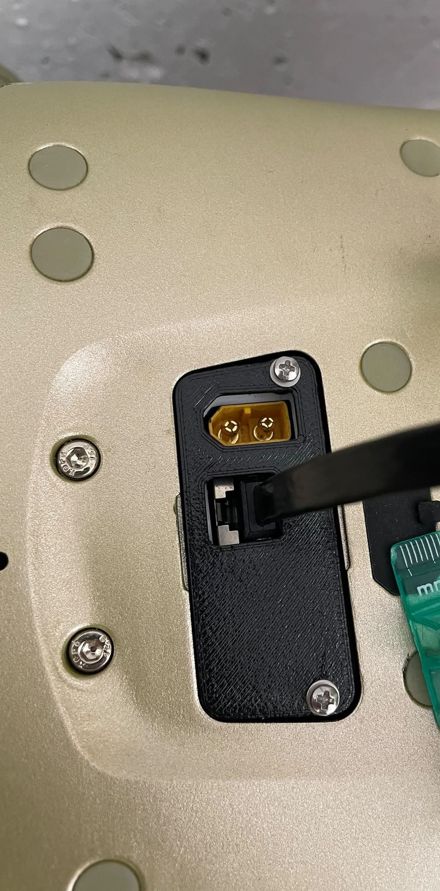

# Connector Cap — reverse-engineered from photos

*The robot was a cheap commercial unit — no CAD, no drawings, just a recessed connector panel
that needed a cover. So I did what you do when there's nothing to download: photographed the
panel next to a credit card, turned the card's known size into a ruler, and rebuilt the panel
in CAD from pixels. Here's the reverse-engineering — overlay-print checks and handedness
mix-ups included.*

## What This Is

A 3D-printable **cover cap** for the recessed connector panel of a commercially-available
robot. The unit ships with no CAD and no dimensioned drawings (it's a low-end commercial
model — the kind where measure-and-print *is* the path, because there's nothing to pull), so
the cap was modelled parametrically in [build123d](https://github.com/gumyr/build123d) from
**measurements recovered out of photographs**, then validated against the real part with a
1:1 paper overlay.

Built with the [`agentic-3d-modeling`](https://github.com/evnchn-agentic/agentic-3d-modeling)
discipline — every dimension is a *number*, checked, not eyeballed.

## The Journey

### Phase 0 — No CAD, no calipers, just a phone
The panel sits in a recess with three ports and two panel screws. No drawings exist, and at
the time I didn't even have the part in hand — only photos. The whole problem became: *how do
you get real millimetres out of a JPEG?*

### Phase 1 — A credit card is a free ruler
An ISO/IEC 7810 ID-1 card is exactly **85.60 × 53.98 mm** — so put one in the frame, threshold
its colour, label the blob, and you have a pixel→mm scale. Cross-check the scale on the X and
Y axes separately, because perspective makes them disagree — and that disagreement is data,
not noise.

### Phase 2 — Trust nothing; print the model at 1:1 and lay the real part on it
Pixels lie at the edges. So the model emits a **true 1:1 PDF** (`figsize = mm / 25.4`, axes
pinned to the page, *no* "fit to page" rescaling, a 10 mm verify-bar in the corner). Print at
100%, drop the physical part on top, read the residuals in millimetres. The correction it
revealed was **per-axis, not uniform** — a screen/print overlay stretches each axis
differently — so each axis gets corrected independently.

### Phase 3 — Model the cap (the support-free tricks)
A thin-walled shell (no lip — a solid block read as "a hunk"), a chamfered window for the
power connector, a slot for the data cable, and **M2 counterbored screws**. The print-time
move worth stealing: each counterbore floor gets a **0.2 mm membrane** so the printer
*bridges* a flat instead of trying to ceiling an overhang — then you drill through the
0.2 mm after. Vertical screw bores print undersized and faceted, so they're reamed, not
trusted as-modelled.

### Phase 4 — Two variants from one source
One parametric script, two outputs: a **dev** cap with a full data-port window for bench
work, and a **sleek** cap with a slim, disguised cable slot for a tidy finish. Changing
between them is a one-line flag, not a forked file.

### The honest bits
- **Handedness is the #1 trap.** Left/right + flip orientation, mapped against a physical
  overlay, bit repeatedly — a Y-mirror of an X-symmetric profile *looks* like a 180° rotation
  but silently throws the chamfer and the screws to the wrong edge. Mirror only what's
  referenced to the moved edge; edge-referenced features must **not** be mirrored.
- **Winding sets extrude direction.** A clockwise-wound cut profile silently extrudes the
  wrong way and the boolean misses — caught only by asserting the volume *dropped* after each
  cut.

---

*Scope: a generic cover for a commercial robot's panel — the where and the for-whom are left
out on purpose. The process notes (verify loops, the gotchas) live in the
[`agentic-3d-modeling`](https://github.com/evnchn-agentic/agentic-3d-modeling) skill; this is
the real case where photo-scaling, overlay checks, and handedness all bit.*

## Files

`build_cap.py` (parametric model → STEP/STL + section/iso/printability views) ·
`cap_dev` / `cap_sleek` (`.step`/`.stl`) · `scale1to1.py` (the 1:1 overlay PDF) ·
`measure_drawing.py` (credit-card-scale outline extraction).
